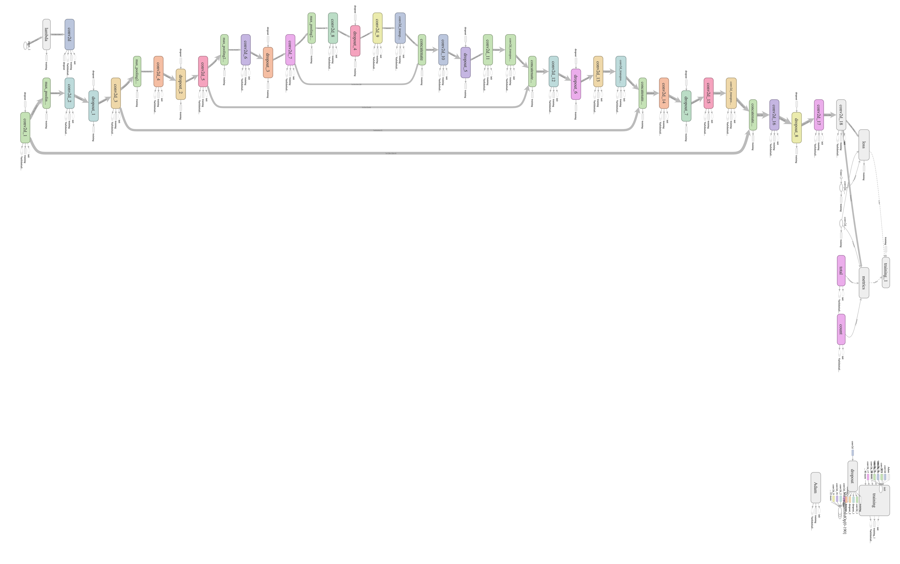
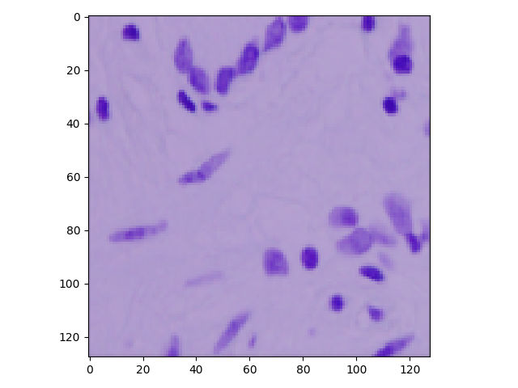
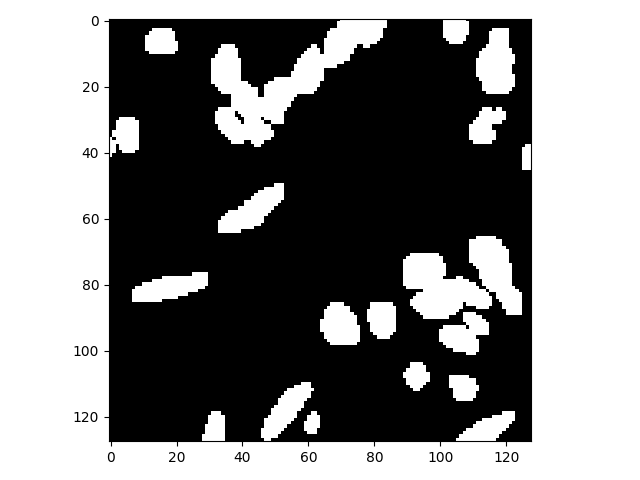
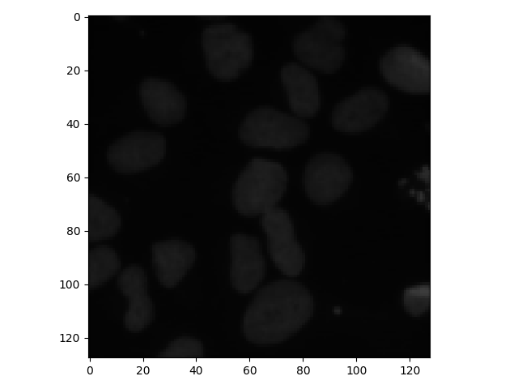
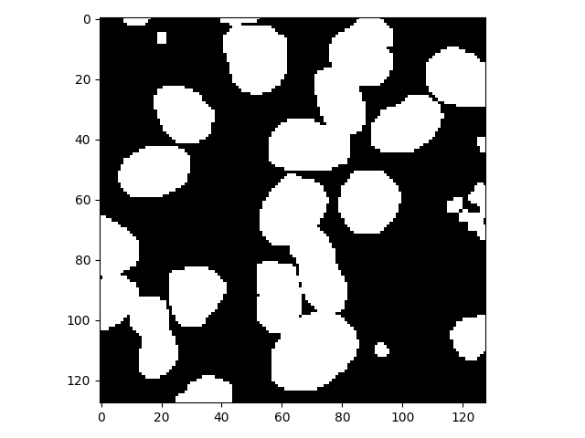

# U_Net for medical image segmentation

In this repo I have implemented the U_Net architecture as proposed in this paper - [U-Net: Convolutional Networks for Biomedical Image Segmentation ](https://arxiv.org/pdf/1505.04597.pdf) .
The architecture in the paper is as follows:

I have not implemented the architecture as it is but made some minor changes like adding dropouts etc. to improve my accuracy.
The final architecture I used is as follows:

arch.py - file contains the code for the architecture   
data.py - file contains all the neccesary code for data preprocessing, one can make changes in this file according to their own dataset
#### To train-
python main.py

#### Requirement:
Tensorflow>=1.13.1
#### Dataset used here:
2018 Data Science Bowl | Kaggle   
I have trained this architecture for cell nucleus detection from images.Masks of the cell nuclei are provided with the dataset to train our model for segmentation purpose.Training image example-

#### Mask of the above image-
 

## Following are the test results:
 

